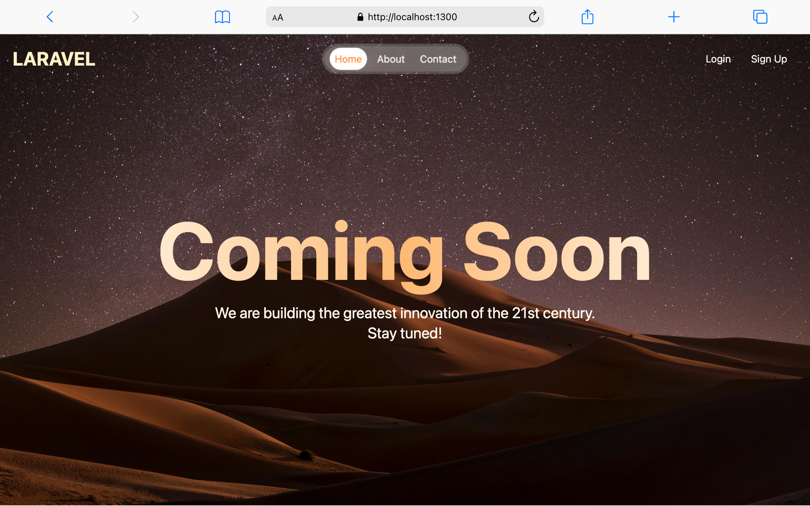

# Project Title

Laravel Inertia Vue template

## Description



I have customised a Laravel project to suit my needs whenever I want to build with Inertia and Vue. I have installed libraries like Tailwindcss, Fontawesome, SweetAlert because I often have to install them on every project.

I have also done the authentication, authorization and user roles and permissions.

### Installing

* Clone the project
```
git clone https://github.com/Zichis/laravel_inertia_vue_template.git my_project
```
* Navigate to the root of the project and run the command to start the back end
```
php -S localhost:8000 -t public
```

* In a separate terminal run the command to start the front end
```
npm run dev
```

## Authors

Contributors names and contact info

Ezichi Ebere Ezichi
[@Zichis](https://twitter.com/Zichis)